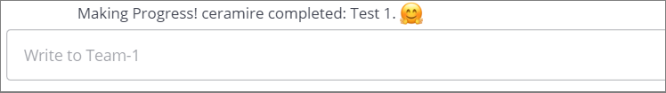
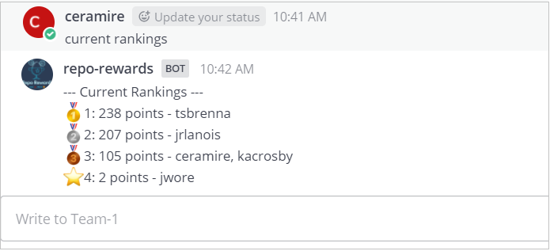
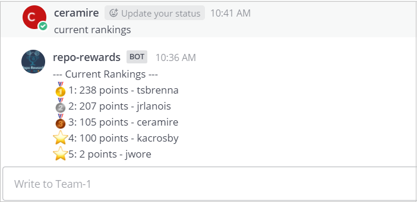
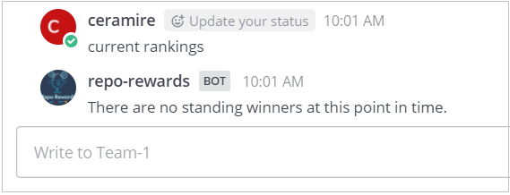
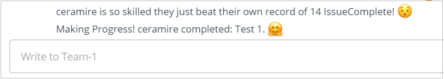

# Repo Rewards Bot

## The Problem Repo Rewards Solves
The problem is that, when developing a Software Project, the workload can be distributed unevenly between team members, or an individual’s extra effort may go unnoticed by their teammates. When the workload is unevenly distributed, a team’s productivity can be disproportionately impacted by one member's absence, decreasing what can be delivered to users.

Repo Rewards tackles this problem by creating a points system in which every member of a team earns points every time he completes a task within GitHub. It also keeps the scores and a ranking for the whole team. The bot will send messages every time someone earns points. 

The idea is to try to incentivize people by rewarding them for following good practices. With scores and rankings, a manager or team leader could redistribute the workload when an imbalance is detected. Imbalance issues aside, if one user is just unexpectedly productive over an interval, that success can be recognized by their peers. Furthermore, by writing to a chat instead of sending an email, there is a lower barrier to engagement with the information, so more of the team is likely to notice it. Providing these features will allow a team to stay motivated and help keep the workload evenly shared by everyone.

## The Primary Features of Repo Rewards
The features implemented in Repo Reward are the following.
1.	The bot sends a message when a user completes a task. Completing a task refers to creating or closing an Issue or getting a Pull Request approved. 

<br>
<p align="center">
  
       <br>Figure 1. Issue Completed
</p>
<br>

2. When a user request to see the rankings, by writing ‘current rankings’ in the chat, the bot will respond with the rankings. In Figure 2, Figure 3, and Figure 4 we can see the bot responses. In Figure 3 we can see that when 2 users are tied with the same points, the bot will report both of their names in the same line. In Figure 4 we can see the bot response where there are no points registered in the system yet (i.e. a new project that still has no tasks completed).

<br>
<p align="center">
  
       <br>Figure 2. Rankings
</p>

<br>
<p align="center">
  
       <br>Figure 3. Rankings with users tied
</p>

<br>
<p align="center">
  
       <br>Figure 4. No standing winners
</p>
<br>

3.	The bot keeps records per task for each user. When a user completes a task and breaks his own record, the bot will send a message congratulating him. 

<br>
<p align="center">
  
       <br>Figure 5. Record made
</p>
<br>

4.	There’s also a no_chat option that can be set in a custom configuration file and the bot will not send any message unless queried. There configuration file would be a json file with the following content:

```
{"notification_center": {"enable_startup_notifications": true, "event_types": {}}
```
 And the bot will need to be restarted with the following commad:
 
 ```
 ansible-playbook --vault-password-file <vault_key_file> -i inventory.yaml -e "GITHUBTOKEN=$GITHUBTOKEN src_config_path=<onfig_file>" -v deploy-bot.yaml`
 ```
<br>

## Reflection on Development Process

The development process consisted of four major stages: Design, Bot, Process, and Deploy. Each stage had particular goals and required the equal participation of all group members. 

During the Design stage, we decided to start independently to brain storm ideas on what would make an effective and encouraging chatbot and in what situations it would be most helpful. Once we met, it was decided that developers would benefit from having a rewards bot for github repo participation. We started working on use cases, which would be our foundational plans for implementing the bot with simple design. We created mock-up design sketches of how we wanted the bot to interact with the user. Then we created the architecture design plan that allowed us to start planning the components and constraints of the rewards bot. Overall, this stage was built around "sitting together" and developing strategies and ideas as a team. Most of the work was done simultaneously. 

During the Bot stage, we started developing the actual infrastructure. We had team meetings to determine what tasks would be performed by who, and then added this information via github issues and the project board to our repository. We started by adding mocking, bot components, and testing. It was during this stage we saw some differences in experience with the team and would implement pair programming and code standards to help make our work more cohesive and correct. At the end of this, we used refactoring to also make sure that the work everyone had done was the most efficient, not duplicated, and contained everything that was necessary for the bot. This stage was more of a learning stage for the team and we had challenges but used communication and teamwork to push past any obstacles. 

During the Process stage, we used scrum meetings instead of the "meeting only as needed" method. This actually showed improvement in our ability to keep track of the progress being made and make adjustments to our plans. Because we stayed informed on progress, there was no procrastination and there was consistent work being done throughout the week. The meeting every day might have felt tedious, but the results of having problems solved together on a daily basis was worth the time investment. We used refactoring to ensure that all of the code was working together and defined. The project board also allowed us to see the progress that was being made and adjust our own timing if we needed to wait on another person's update. For the second sprint of the process stage, we actually used the project kanban board more consistently and it made it easy to see how tasks were being completed. The workload was evenly split and the teamwork to solve problems and integrate changes went smoothly. During the second sprint, two amendments were made to the original design to impvoe usability and to close a possible loophole in the rewards system. There were a few merging issues but once we had a meeting we all worked together to assign what was necessry to keep and solve the conflicts. 

During the Deploy stage, we continued to use scrum meetings because of the consistent updates and efficiency it provided to our group. This week, however, had some conflicting schedules and made it hard to have full group participation for a couple of days during the meetings. We dealt with this by having the missing team member update us later and review the scrum meeting notes. On top of the conflicting schedule, lots of issues arose later during the integration part of the plan. We made changes that were needed for deployment on Ubuntu and ultimately were satisfied with the work we did with Ansible and our Bot. 

## Limitations and Future Ideas

Our Reward Bot was designed modularly with the intent to allow for components to be swapped in and out, or evolved over time. As such, there are a wealth of future work opportunities for Reward Bot.

Limitations were somewhat more scarce outside of the time aspect. One could consider that having a large amount of ideas for the bot but only implementing a handful of them is a limitation, but it could also be viewed as appropriately sizing the project to the time available.

### Git Tokens

We had a bit of difficulty getting the GitHub tokens to work. To be specific, our tokens would work initially, and then abruptly stop working. This seemed like a limitation with GitHub. Investigation identified that one a user's token stopped working, it would persist in this state. As such, there came a point at the end of the project during the deployment testing where we had to scramble because the user who was doing the final touches testing the bot for final delivery had their token expire an hour before the deadline, so we had to pull in someone else at the last minute to finish everything. Given that this was at the end of the project, we did not have sufficient time to investigate like we would have liked.

Guesses as to what may have caused this could involve throttling on the side of GitHub. We adjusted the bot's query frequency to something we thought was acceptable (Once every 25 seconds for a big query, and once every 5 seconds for a small one). Without knowing the QOS settings of the system, we were just guessing and could have been hitting the server too often. Another guess could be that the connection with the API is persistent, and failing to properly close the connection of process exit was resulting in stale connections taking up the allotted connection count if there was a limit.

### Event Storage

Currently, our bot uses memory storage to keep track of the various events that occur. This means that when the bot is turned off, data is lost. Given the duration of development for the bot being short, and the anticipated requirement to deploy the bot later, we decided that using a database would be outside of the scope, adding limited functionality at the cost of a rather large investment in addition debugging, testing, and deployment concerns. This would be an excellent feature to be tackled in the future, and recommend it as one of the first future work items addressed as it would allow for data to persist between updates for subsequent changes.

### Chat Clients

Our bot was initially configured to work with the Mattermost Chat Client because that was what was provided and managed by the school. None of us use Mattermost outside of this context however, and would be interested in seeing the bot expand into other chat Clients. In particular, we are interested in expanding support to include Slack, Discord, and Microsoft Teams. These other clients would provide good coverage for both commercial and hobbyist developers. We already have the framework in place for the abstract concept of a chat client which Mattermost implements, so each new client would only need to implement that interface before being ready to include. We believe this would make the bot more immediately relevant to a wider audience, and would likely result in broader adoption.

### Remote Git Servers

Currently, the bot is only configured to allow any number of Receivers to write to the event storage. We only implemented the Chat and Git Receivers, but another desirable receiver would be one that interfaces with BitBucket by Atlassian. By supporting BitBucket, the bot would have better reach into a corporate setting with secured on-prem deployment. Given that our bot is event driven, BitBucket and GitHub would generate the same events, so no other aspects would need to change besides what to configure.

### Additional Repositories

Currently, the bot is only configured to track a single repository. With some clever config adjustment and updating the query command, we should be able to support tracking multiple repos with the same bot. This will improve the usability for teams that manage a collection of repos in a stack instead of one monolithic architecture.

### More Reward Types

Currently we support rewards for Creating Issues, Closing Issues, and Reviewing a Pull Request. It would be excellent if we could expand on this to allow for more types of rewards. Some additional types we could consider would be dividing code reviews into Needs Work Reviews and Approval reviews. That would allow groups to incentivize high quality by awarding more points for finding a flaw than for providing just an approval.

### More Scoring Options

Similar to the different additions to events to award, we could add additional ways of awarding points. Perhaps points could be offered for getting your code reviewed with minimal Needs Work iterations, or potentially offering more points per Approval made prior to merge to incentivize ensuring the code is reviewed more thoroughly before merging. We could also consider awarding points relative to the number or lines or files modified in the pull request. This would incentivize thoroughness when doing refactors or deprecations which often go under-appreciated.

A simpler approach to improving score that could be implemented would be awarding points based on each streak the individual achieves, or the size of their largest record for a given event type.

## Screencast Presentation of the Bot

[Repo Rewards Presentation](https://youtu.be/M3LV2EKZJTE)


