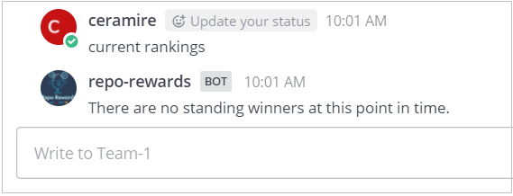
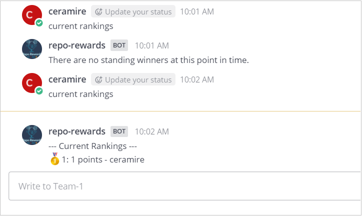
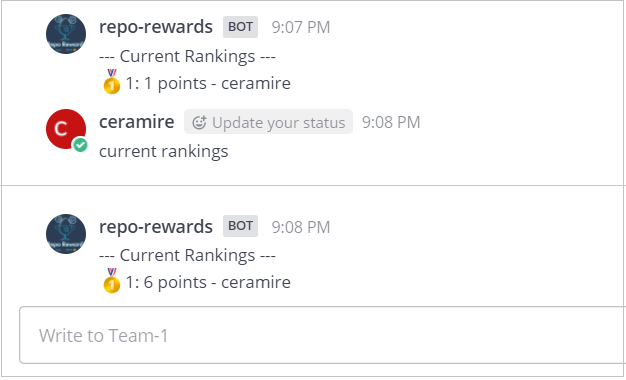

# Acceptance Tests with no_chat option

In these tests we will ensure that the bot responds as expected when set with the no_chat option.

## Preconditions
The bot must have Github api developer token in the system and be configured to track a project.

The user must have a GITHUBTOKEN in their local system.

The user must have ansible installed in their local system in order to be able to run the playbooks.

The user must have the vault_key file in their system

The user must be logged in https://github.ncsu.edu/

### Copy no_chat config file

To be able to run these test it is necessary that the user copy the config.js configured with the no_chat option within the bot folders and then restart it. Please follow the next steps:

1. First you need to create a config.json file with the following content:

```
{    "notification_center": {"enable_startup_notifications": true, "event_types": {}
        },        
     "git_config" : {
        "url": "https://github.ncsu.edu/api/v3",
        "repo": "Project_tests",
        "owner": "ceramire",
        "auth": "process.env.GITHUBTOKEN",
        "check_cadence": "*/25 * * * * *"
    }
}
```

2. In an Ubuntu shell enter the following command and press enter. The bot will restart
```
ansible-playbook --vault-password-file <path to your vault_key> -i inventory.yaml -e "GITHUBTOKEN=$GITHUBTOKEN src_config_path=<path to the config file>" -v deploy-bot.yaml`
```
## Test # 1 - Alternative flow [E1] for Use Case 2
There are no current points or user standings and the bot will respond with a message indicating so.

1. In a navigator open the [Mattermost channel for Team 1](https://chat.robotcodelab.com/csc510-s22/channels/team-1)
2. Write 'current rankings' and press enter
3. The bot will respond with the following message: There are no standing winners at this point in time. (See Fig.1)

<br>
<p align="center">
  
       <br>Fig.1
</p>

<br>

## Test # 2 - Alternative flow [E1] for Use Case 1
The user will complete a task, the bot won't send any message but it will update the points.

1. In a navigator open the [Mattermost channel for Team 1](https://chat.robotcodelab.com/csc510-s22/channels/team-1)
2. In another window open the [GitHub Project_tests repo](https://github.ncsu.edu/ceramire/Project_tests)
2. Within the GitHub repository go to issues and create a new issue.
3. The bot will not send a message to the user, but it will update the user's points. In the Mattermost window you will not receive any notification. 
4. In the Mattermost channel write current rankings and press enter.
5. The bot will show the updated rankings. The Mattermost chat will show you something like Fig.2.

<br>
<p align="center">
  
       <br>Fig.2
</p>

<br>

## Test # 3 - Alternative flow [E1] for Use Case 3
The user will complete a task and break his own record, the bot won't send any message but it will update the points.

1. In a navigator open the [Mattermost channel for Team 1](https://chat.robotcodelab.com/csc510-s22/channels/team-1)
2. In another window open the [GitHub Project_tests repo](https://github.ncsu.edu/ceramire/Project_tests)
2. Within the GitHub repository go to issues and close the issue that you just created.
3. The bot will not send a message to the user, but it will update the user's points and records. In the Mattermost window you will not receive any notification. 
4. In the Mattermost channel write current rankings and press enter. It can take up to a minute for the task to populate.
5. The bot will show the updated rankings. The Mattermost chat will show you something like Fig.3.

<br>
<p align="center">
  
       <br>Fig.3
</p>

<br>


## Follow up Actions

### Activate chat 

If you want to activate the chat option now, please follow the next steps:

1. In an Ubunto shell enter the following command and press enter. The bot will restart.
```
ansible-playbook --vault-password-file <path to your vault_key> -i inventory.yaml -e "GITHUBTOKEN=$GITHUBTOKEN" -v deploy-bot.yaml`
```

<b>Note:</b> Once the bot is restarted with the chat option, it won't send any messages (unless queried) until the next reset day that is set as 9am. The Startup Notifications can be enabled in the config file by setting `{"notification_center": {"enable_startup_notifications": true}}`
