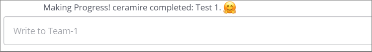

# Acceptance Tests Use Case 1

In these tests we will ensure that the bot responds as expected when a user completes a task within the GitHub repository.

## Preconditions
The bot must have Github api developer token in the system and be configured to track a project.

The user must have a GITHUBTOKEN in the system.

The user must be logged in https://github.ncsu.edu/

## Test # 1
1. In a navigator open the [Mattermost channel for Team 1](https://chat.robotcodelab.com/csc510-s22/channels/team-1)
2. In another window open the [GitHub repository for Team 1](https://github.ncsu.edu/csc510-s2022/CSC510-1)
2. Within the GitHub repository go to issues and you will find Test Issues that have been created for these tests. Click one of those issues and then close it.
3. In the Mattermost window you will receive a notification indicating that your user just closed an issue (See Fig.1).

 

  
        Fig.1

