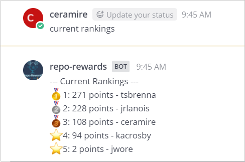
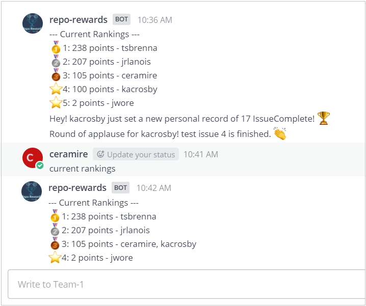
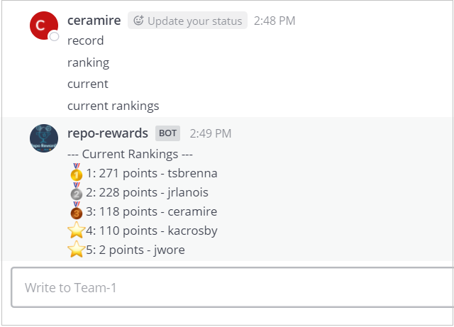

# Acceptance Tests Use Case 2

In these tests we will ensure that the bot responds as expected when a user checks the leaderboard.

## Preconditions
The bot must have Github api developer token in the system and be configured to track a project.

The user must have a GITHUBTOKEN in the system.

The user must be logged in https://github.ncsu.edu/

## Test # 1
The bot will respond with the current rankings when queried.

1. In a navigator open the [Mattermost channel for Team 1](https://chat.robotcodelab.com/csc510-s22/channels/team-1)
2. Write 'current rankings' and press enter
3. The bot will respond with the current rankings (See Fig.1)

 

  
        Fig.1

 

## Test # 2 - Alternative Flow [E2]
There is a tie between two users. The bot will respond with their names listed beside each other.

1. In a navigator open the [Mattermost channel for Team 1](https://chat.robotcodelab.com/csc510-s22/channels/team-1)
2. In another window open the [GitHub repository for Team 1](https://github.ncsu.edu/csc510-s2022/CSC510-1)
3. Within the Git repository go to Issues and create 2 new issues. This will give you 2 points and your user will be tied with jwore user. Note: We are assuming that jwore hasn't uploaded any other feedback by the time you are doing the tests. If he has, then you would need to create 3 issues instead of 2 in order to have 3 points. The points system gives 1 point for creating an issue, 5 points for closing an issue, and 3 points for having a pull request approved.
3. Write 'current rankings' and press enter
4. The bot will respond with the new current rankings, showing your user and jwore in the same line  (See Fig.3)

 

  
        Fig.3

 

## Test # 3 - Alternative Flow
The bot only responds to "current rankings"

1. In a navigator open the [Mattermost channel for Team 1](https://chat.robotcodelab.com/csc510-s22/channels/team-1)
2. Write anything different to 'current rankings' and press enter, i.e. current, rankings, current ranking, hello, etc.
3. The bot will not respond. You can see in Fig. 2 that it only responds to current rankings.

 

  
        Fig.2

 

