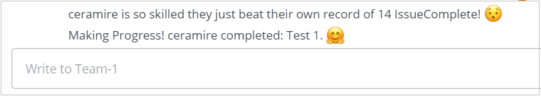
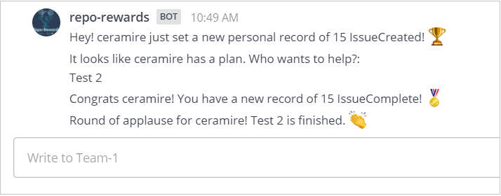

# Acceptance Tests Use Case 3

In these tests we will ensure that the bot responds as expected when a user makes a new record.

## Preconditions
The bot must have Github api developer token in the system and be configured to track a project.

The user must have a GITHUBTOKEN in the system.

The user must be logged in https://github.ncsu.edu/

## Test # 1
The user makes a new record when completing a task, the bot will notify the user that he just beat his own record

1. In a navigator open the [Mattermost channel for Team 1](https://chat.robotcodelab.com/csc510-s22/channels/team-1)
2. In another window open the [GitHub repository for Team 1](https://github.ncsu.edu/csc510-s2022/CSC510-1)
3. Within the Git repository go to Issues and create 1 new issue. The bot will update your points and will notify you of your broken record. (See Fig.1)

 

  
        Fig.1

 

## Test # 2 - Alternative Flow [E2]
The user makes multiple records, the bot will respond with all the broken records.

1. In a navigator open the [Mattermost channel for Team 1](https://chat.robotcodelab.com/csc510-s22/channels/team-1)
2. In another window open the [GitHub repository for Team 1](https://github.ncsu.edu/csc510-s2022/CSC510-1)
3. Within the Git repository go to Issues and create 1 new issue, and close it. The bot will update your points and will notify you of your broken records. (See Fig.2)

 

  
        Fig.2

